# Отчёт по домашнему заданию 1 (картинки и текст скомпонованы вместе с кодексом, к сожалению были проблемы с ботом и я не видела файла домашнего задания, мне сразу предлагали сдать,  побоялась нажать на эту кнопку, прочитала только сегодня полный файл с трбеованиями и поправила как могла, оприентировалась на дз из презентации.)

Проект: сервис предсказания оттока клиентов банка.

Модель сохранена в `artifact/bank_churn.joblib`. Артефакт содержит обученный `Pipeline` и метаданные: список признаков, версию модели и порог классификации. ноутбук обучения находится в `bank_churn_python.ipynb`, паспорт модели — в `artifact/bank_churn.metadata.json`.

## Проверка проекта

### Тесты

Команда `uv run pytest -v` завершилась успешно: пройдено 10 тестов.

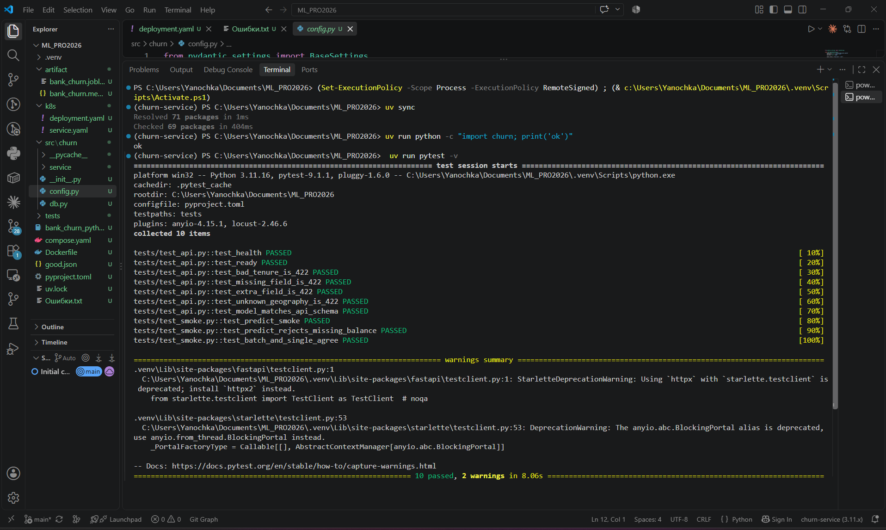

### Локальный запуск API

Сервис запускается через Uvicorn командой `uv run uvicorn churn.service.app:app --port 8000`.

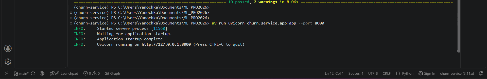

Проверка `/health` и успешный запрос `/v1/predict` вернули `200 OK`. Ответ содержит score, churn, версию модели, `request_id` и `latency_ms`.

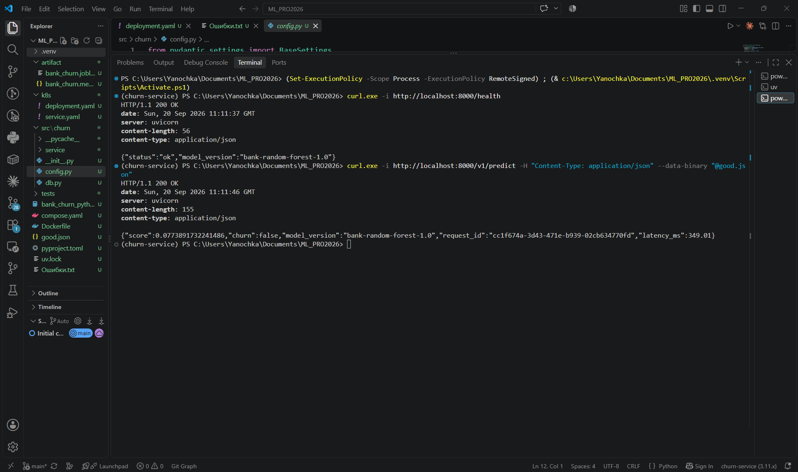

Некорректное значение `Tenure` отклоняется с кодом `422 Unprocessable Entity`.

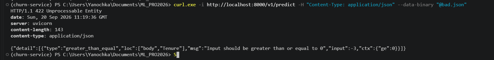

### Docker и Compose

Docker-образ `churn-service:1.0` собирается успешно.

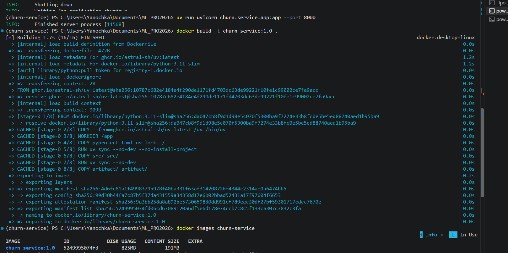

`docker compose up -d --build` запускает API и PostgreSQL. База проходит healthcheck, API собирается и запускается.

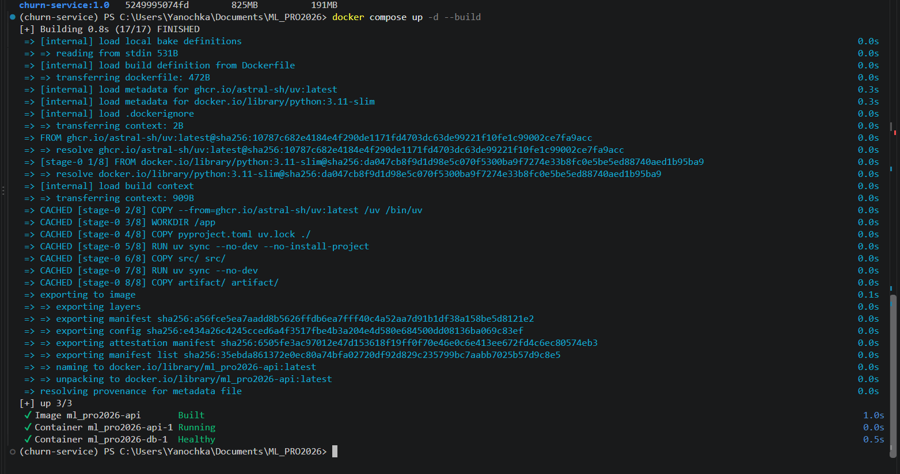

Предсказания записываются в таблицу `predictions` PostgreSQL. На скриншоте показаны `request_id`, версия модели, score и latency.

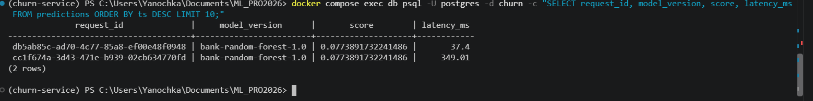

### Kubernetes и kind

Локальный кластер kind использует контекст `kind-mlpro`. Образ загружен на узел кластера, манифесты применены.

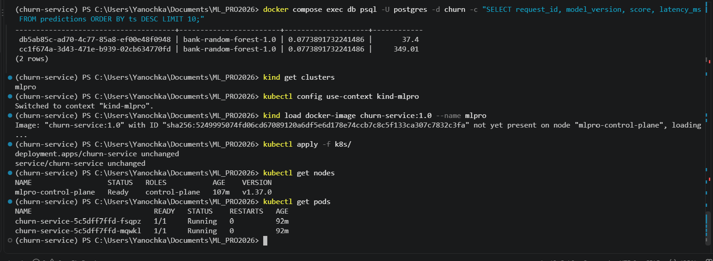

Deployment запущен с двумя репликами: оба пода имеют состояние `Running` и готовность `1/1`.

### Запрос через port-forward

Сервис опубликован локально командой `kubectl port-forward service/churn-service 8080:80`.

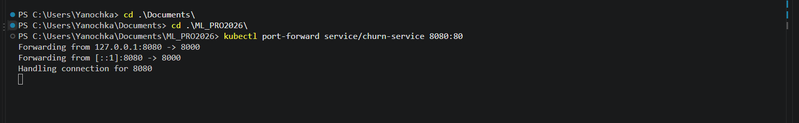

Через порт-forward выполнен запрос к `/v1/predict`; сервис вернул успешный ответ с прогнозом и идентификатором запроса.

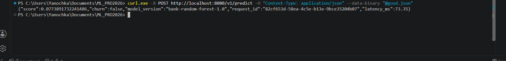

### k9s

В `k9s` видны две реплики сервиса, обе работают и готовы принимать трафик.

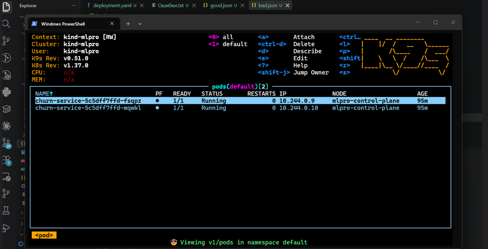

## Журнал проблем

Во время работы были исправлены следующие проблемы:

- `uv sync` не находил пакет из-за опечатки `pydentic-settings`; исправлено на `pydantic-settings`.
- В `pyproject.toml` были исправлены настройки `tool.uv.build-backend` и `module-name`.
- Исправлен путь к артефакту модели: `artifact/bank_churn.joblib`.
- Для запуска тестов использовалась команда `uv run pytest`, а не `uv run pytests`.
- Docker Desktop был запущен после ошибки подключения к `dockerDesktopLinuxEngine`.
- В PowerShell для запросов использовался `curl.exe` и обычные дефисы командной строки.
- При работе Kubernetes была исправлена ошибка отсутствующего `ConfigMap`, а ресурсы подов уменьшены до `256Mi` request и `512Mi` limit после ошибки `Insufficient memory`.
- Для запуска `k9s` каталог программы был добавлен в пользовательский `PATH`.
